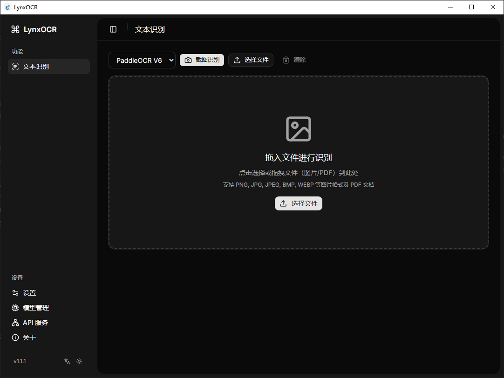
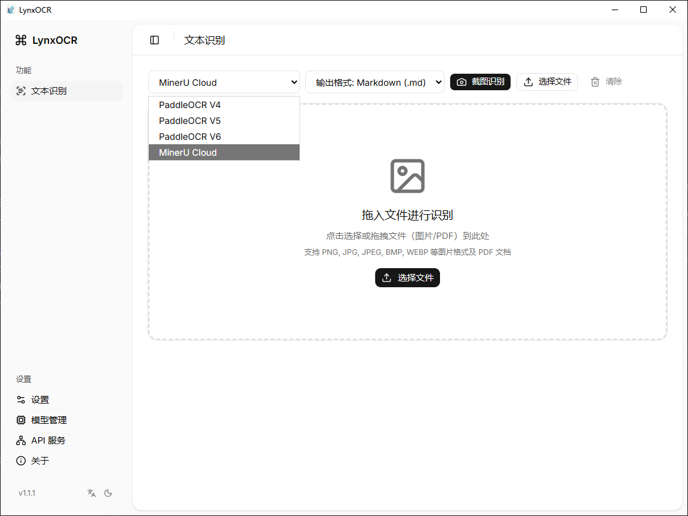

<p align="center">
  
</p>

<h1 align="center">LynxOCR</h1>

<p align="center">
  极速离线 OCR 文字识别工具 — 所有处理完全在本地完成，数据隐私无忧。

  PaddleOCR V4/V5/V6 · MinerU 云端解析 · 截图 OCR · PDF OCR · 批量处理 · HTTP API
</p>

<p align="center">
  <a href="https://github.com/tabortao/LynxOCR/releases"></a>
  <a href="LICENSE"></a>
  
  <a href="docs/ChangeLog.md"></a>
</p>

<p align="center">
  <a href="README.md">English</a>
</p>

<p align="center">
  
  
</p>

---

## 概述

LynxOCR 是一款基于 Tauri v2、Rust 和 React 构建的跨平台桌面 OCR 应用。它通过 ONNX Runtime 在本地运行 PaddleOCR ONNX 模型 — 无需联网，数据完全在本地处理。同时集成 MinerU 云端 API，提供更高精度的文档解析能力。

设计理念：

- OCR 应该快速、隐私安全、离线可用。
- 截图 OCR 应该是一键操作。
- 批量处理应该是一等公民功能，带有实时进度反馈。
- 界面应该简洁、响应迅速，支持亮色和暗色主题。

## 功能亮点

### 核心 OCR

- **3 种 PaddleOCR 模型**：PP-OCR V4、V5、V6 ONNX 模型，应用内一键下载
- **图片 OCR**：支持拖放或文件选择器加载 PNG、JPG、BMP、WEBP、TIFF 格式图片
- **PDF OCR**：渲染并识别多页 PDF 文档中的文字
- **截图 OCR**：全局快捷键（`Ctrl+Shift+O`）— 框选任意屏幕区域，自动识别并复制到剪贴板
- **批量处理**：支持多文件批量识别，实时显示单项进度和总体进度

### MinerU 云端集成

- **极速提取**：无需 API Token，轻量级 Markdown 提取，支持 10MB 以内的文档
- **精准提取**：完整 API 支持，多格式输出（Markdown、HTML、LaTeX、DOCX、JSON）
- **富文本预览**：Markdown 渲染预览，支持表格、LaTeX 公式、代码块
- **格式导出**：支持导出任意格式的识别结果

### 内置 HTTP API

- **RESTful API**：`POST /api/v1/ocr` 供程序化调用
- **三种输入方式**：本地文件上传、Base64 编码、图片 URL
- **Bearer Token 认证**：可选 API 密钥保障安全
- **开机自启**：可配置应用启动时自动开启 API 服务

### 使用体验

- **系统托盘**：关闭窗口最小化到托盘，左键恢复，右键退出
- **单实例运行**：同时只能运行一个实例，再次启动时激活已有窗口
- **多语言界面**：支持中文 / 英文切换
- **暗色主题**：完整的亮色 / 暗色模式支持
- **模型管理**：下载、切换、管理 OCR 模型，带进度追踪

## 技术栈

| 层级 | 技术 | 版本 |
|------|------|------|
| 桌面框架 | [Tauri](https://v2.tauri.app) | v2 |
| 后端 | Rust | 2024 Edition |
| 前端 | [React](https://react.dev) | v19 |
| TypeScript | | ~5.7 |
| 构建工具 | [Vite](https://vite.dev) | v8 |
| CSS | [Tailwind CSS](https://tailwindcss.com) | v4 |
| UI 组件 | [Radix UI](https://www.radix-ui.com) + [shadcn/ui](https://ui.shadcn.com) |
| OCR 引擎 | [PaddleOCR](https://github.com/PaddlePaddle/PaddleOCR) via [paddle-ocr-rs](https://github.com/mg-chao/paddle-ocr-rs) |
| ONNX 运行时 | [ort](https://github.com/pykeio/ort) | v2.0.0-rc.10 |
| 截图 | [xcap](https://github.com/nicepkg/xcap) |
| PDF 渲染 | [pdfium-render](https://github.com/ajrcarey/pdfium-render) |
| HTTP 客户端 | [ureq](https://github.com/algesten/ureq) | v2 |
| HTTP 服务 | [axum](https://github.com/tokio-rs/axum) | v0.7 |
| 异步运行时 | [tokio](https://tokio.rs) | v1 |
| 包管理器 | [Bun](https://bun.sh) |

## 快速开始

### 环境要求

- [Bun](https://bun.sh) >= 1.0
- [Rust](https://rustup.rs) >= 1.70
- Windows：需安装 MSVC Build Tools（C++ 桌面开发）

### 开发模式

```bash
git clone https://github.com/tabortao/LynxOCR.git
cd LynxOCR

# 安装依赖
bun install

# 开发模式运行
bun run tauri dev
```

### 构建

```bash
bun run tauri build
```

构建产物位于 `src-tauri/target/release/bundle/`。

### 模型下载

OCR 模型可在应用内下载：**设置 → 模型管理 → 下载**。

| 模型 | 大小 | 说明 |
|------|------|------|
| PP-OCR V4 | 约 25MB | 轻量中英文检测与识别 |
| PP-OCR V5 | 约 25MB | 更高精度 |
| PP-OCR V6 | 约 25MB | 最新版本，识别精度最高 |

模型存储在可配置的本地目录中：

| 系统 | 默认路径 |
|------|---------|
| Windows | `%APPDATA%\LynxOCR\models` |
| macOS | `~/Library/Application Support/LynxOCR/models` |
| Linux | `~/.local/share/LynxOCR/models` |

### 手动下载

如果应用内下载速度较慢，可通过以下镜像手动下载模型：

- Gitcode：[https://gitcode.com/tabortao/LynxOCR/releases/model](https://gitcode.com/tabortao/LynxOCR/releases/model)
- Gitee：[https://gitee.com/tabortao/LynxOCR/releases/model](https://gitee.com/tabortao/LynxOCR/releases/model)
- 魔搭社区：[https://www.modelscope.cn/models/tabortao/sherpa-onnx-asr-int8/tree/master/PaddleOCR-onnx](https://www.modelscope.cn/models/tabortao/sherpa-onnx-asr-int8/tree/master/PaddleOCR-onnx)
- 蓝奏云：[https://wwbtm.lanzouu.com/b01d70renc](https://wwbtm.lanzouu.com/b01d70renc) 密码：`fwoq`

下载后解压到对应系统的模型目录即可。

## HTTP API

在应用内通过 **API 服务** 页面启动服务器（默认端口 `9720`）。

```bash
# 健康检查
curl http://localhost:9720/api/v1/health

# 本地图片 OCR
curl -X POST http://localhost:9720/api/v1/ocr -F "image=@screenshot.png"

# 图床链接 OCR
curl -X POST http://localhost:9720/api/v1/ocr \
  -H "Content-Type: application/json" \
  -d '{"url": "https://example.com/image.png"}'

# Base64 图片 OCR
curl -X POST http://localhost:9720/api/v1/ocr \
  -H "Content-Type: application/json" \
  -d '{"image": "base64_encoded_string"}'
```

详细 API 文档请参阅 [docs/API使用教程.md](docs/API使用教程.md)。

## 项目结构

```text
LynxOCR/
├── src/                          # React 前端
│   ├── app/                      # 页面组件（懒加载）
│   ├── components/               # 通用 UI 组件
│   ├── lib/                      # 应用上下文、国际化、工具函数
│   ├── types/                    # TypeScript 类型定义
│   ├── index.html                # 主应用入口
│   └── screenshot.html           # 截图覆盖层入口
├── src-tauri/                    # Rust 后端
│   ├── src/
│   │   ├── commands/             # Tauri IPC 命令（ocr、model、config、api）
│   │   ├── engine/               # OCR 与 MinerU 引擎模块
│   │   ├── api/                  # Axum HTTP 服务器
│   │   ├── config/               # 应用配置
│   │   └── lib.rs                # 应用状态、命令注册
│   ├── Cargo.toml
│   └── tauri.conf.json
├── docs/                         # 文档
│   ├── ChangeLog.md
│   ├── API使用教程.md
│   ├── OCR优化总结.md
│   ├── 内存优化方案.md
│   └── 截图OCR实现原理.md
├── package.json
├── vite.config.ts
└── tsconfig.json
```

## 文档

| 文档 | 说明 |
|------|------|
| [docs/ChangeLog.md](docs/ChangeLog.md) | 更新日志（Keep a Changelog 格式） |
| [docs/API使用教程.md](docs/API使用教程.md) | HTTP API 使用教程 |
| [docs/OCR优化总结.md](docs/OCR优化总结.md) | OCR 性能优化经验总结 |
| [docs/截图OCR实现原理.md](docs/截图OCR实现原理.md) | 截图 OCR 实现原理 |

## 许可证

MIT License

## 鸣谢

LynxOCR 的构建得益于以下优秀开源项目：

- [PaddleOCR](https://github.com/PaddlePaddle/PaddleOCR) — 出色的多语言 OCR 工具包
- [OnnxOCR](https://github.com/jingsongliujing/OnnxOCR) — 高性能 PaddleOCR ONNX 推理引擎
- [paddle-ocr-rs](https://github.com/mg-chao/paddle-ocr-rs) — PaddleOCR ONNX 推理的 Rust 绑定
- [xcap](https://github.com/nicepkg/xcap) — 跨平台屏幕捕获库
- [pdfium-render](https://github.com/ajrcarey/pdfium-render) — Rust PDF 渲染库
- [Tauri](https://tauri.app/) — 跨平台桌面应用框架
- [React](https://react.dev/) — 前端 UI 库
- [shadcn/ui](https://ui.shadcn.com/) — 精美设计的 UI 组件
- [MinerU](https://mineru.net) — 云端高精度文档解析服务