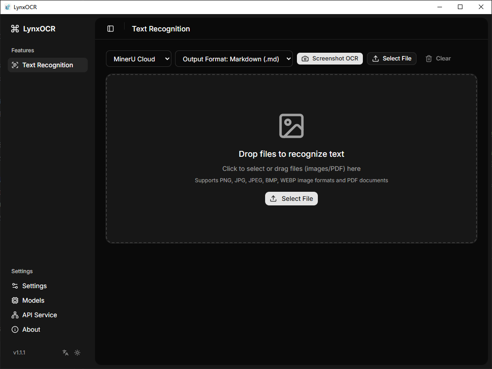
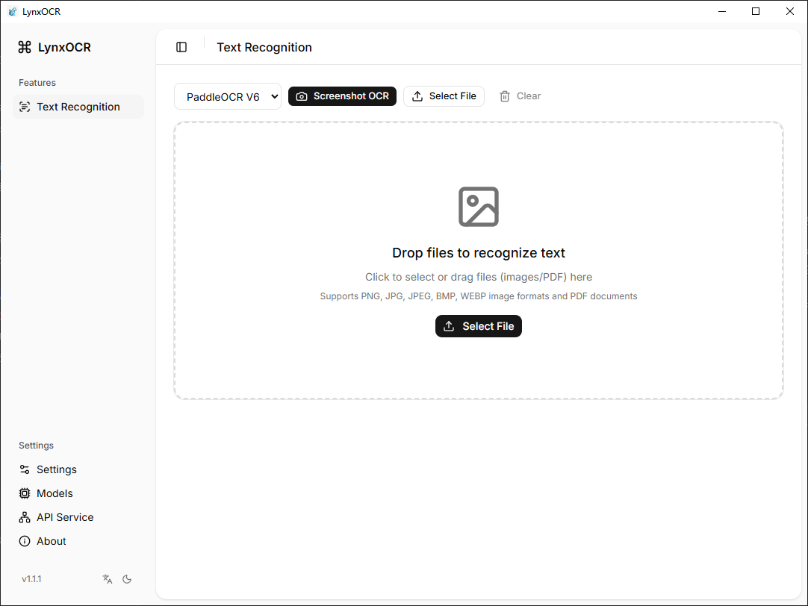

<p align="center">
  
</p>

<h1 align="center">LynxOCR</h1>

<p align="center">
  Blazing-fast offline OCR — all processing on-device, zero data leaves your machine.

  PaddleOCR V4/V5/V6 · MinerU Cloud · Screenshot OCR · PDF OCR · Batch Processing · HTTP API
</p>

<p align="center">
  <a href="https://github.com/tabortao/LynxOCR/releases"></a>
  <a href="LICENSE"></a>
  
  <a href="docs/ChangeLog.md"></a>
</p>

<p align="center">
  <a href="README-zh.md">中文</a>
</p>

<p align="center">
  
  
</p>

---

## Overview

LynxOCR is a cross-platform desktop OCR application built with Tauri v2, Rust, and React. It runs PaddleOCR ONNX models entirely on-device via ONNX Runtime — no internet connection required. For cloud-based high-precision parsing, it also integrates MinerU API.

The app is designed around a few practical ideas:

- OCR should be fast, private, and work offline.
- Screenshot OCR should be a one-keypress operation.
- Batch processing should be a first-class feature with real-time progress.
- The UI should be clean, responsive, and support both light and dark themes.

## Highlights

### Core OCR

- **3 PaddleOCR models**: PP-OCR V4, V5, V6 ONNX — one-click download from within the app
- **Image OCR**: Drag-and-drop or file picker for PNG, JPG, BMP, WEBP, TIFF
- **PDF OCR**: Render and recognize text from multi-page PDF documents
- **Screenshot OCR**: Global shortcut (`Ctrl+Shift+O`) — select any screen region, auto-copy to clipboard
- **Batch processing**: Process multiple files with per-item progress and overall batch status

### MinerU Cloud Integration

- **Flash Extract**: No API token required — lightweight Markdown extraction for documents up to 10MB
- **Precision Extract**: Full API support with multi-format output (Markdown, HTML, LaTeX, DOCX, JSON)
- **Rich preview**: Rendered Markdown with tables, LaTeX formulas, and code blocks
- **Format export**: Export results in any supported format

### Built-in HTTP API

- **RESTful API**: `POST /api/v1/ocr` for programmatic OCR access
- **Three input modes**: Local file upload, Base64 encoding, image URL
- **Bearer token auth**: Optional API key for security
- **Auto-start**: Configurable auto-start on app launch

### User Experience

- **System tray**: Minimize to tray, restore with left-click, quit with right-click
- **Single instance**: Only one instance at a time; re-launching activates the existing window
- **Multi-language**: Chinese / English interface
- **Dark theme**: Full light/dark mode support
- **Model management**: Download, switch, and manage OCR models with progress tracking

## Tech Stack

| Layer | Technology | Version |
|-------|-----------|---------|
| Desktop Framework | [Tauri](https://v2.tauri.app) | v2 |
| Backend | Rust | 2024 Edition |
| Frontend | [React](https://react.dev) | v19 |
| TypeScript | | ~5.7 |
| Build Tool | [Vite](https://vite.dev) | v8 |
| CSS | [Tailwind CSS](https://tailwindcss.com) | v4 |
| UI | [Radix UI](https://www.radix-ui.com) + [shadcn/ui](https://ui.shadcn.com) |
| OCR Engine | [PaddleOCR](https://github.com/PaddlePaddle/PaddleOCR) via [paddle-ocr-rs](https://github.com/mg-chao/paddle-ocr-rs) |
| ONNX Runtime | [ort](https://github.com/pykeio/ort) | v2.0.0-rc.10 |
| Screenshot | [xcap](https://github.com/nicepkg/xcap) |
| PDF Rendering | [pdfium-render](https://github.com/ajrcarey/pdfium-render) |
| HTTP Client | [ureq](https://github.com/algesten/ureq) | v2 |
| HTTP Server | [axum](https://github.com/tokio-rs/axum) | v0.7 |
| Async Runtime | [tokio](https://tokio.rs) | v1 |
| Package Manager | [Bun](https://bun.sh) |

## Getting Started

### Prerequisites

- [Bun](https://bun.sh) >= 1.0
- [Rust](https://rustup.rs) >= 1.70
- Windows: MSVC Build Tools (C++ desktop development)

### Development

```bash
git clone https://github.com/tabortao/LynxOCR.git
cd LynxOCR

# Install dependencies
bun install

# Run in development mode
bun run tauri dev
```

### Build

```bash
bun run tauri build
```

Output artifacts are in `src-tauri/target/release/bundle/`.

### Models

OCR models are downloaded from within the app: **Settings → Model Management → Download**.

| Model | Size | Description |
|-------|------|-------------|
| PP-OCR V4 | ~20MB | Lightweight Chinese/English detection & recognition |
| PP-OCR V5 | ~20MB | Improved accuracy |
| PP-OCR V6 | ~20MB | Latest, highest accuracy |

Models are stored in a configurable local directory:

| Platform | Default Path |
|----------|-------------|
| Windows | `%APPDATA%\LynxOCR\models` |
| macOS | `~/Library/Application Support/LynxOCR/models` |
| Linux | `~/.local/share/LynxOCR/models` |

## HTTP API

Start the API server from the **API Service** page in the app (default port `9720`).

```bash
# Health check
curl http://localhost:9720/api/v1/health

# Local image OCR
curl -X POST http://localhost:9720/api/v1/ocr -F "image=@screenshot.png"

# Image URL OCR
curl -X POST http://localhost:9720/api/v1/ocr \
  -H "Content-Type: application/json" \
  -d '{"url": "https://example.com/image.png"}'

# Base64 image OCR
curl -X POST http://localhost:9720/api/v1/ocr \
  -H "Content-Type: application/json" \
  -d '{"image": "base64_encoded_string"}'
```

For detailed API documentation, see [docs/API使用教程.md](docs/API使用教程.md) (Chinese).

## Project Structure

```text
LynxOCR/
├── src/                          # React frontend
│   ├── app/                      # Page components (lazy-loaded)
│   ├── components/               # Shared UI components
│   ├── lib/                      # App context, i18n, utilities
│   ├── types/                    # TypeScript type definitions
│   ├── index.html                # Main app entry
│   └── screenshot.html           # Screenshot overlay entry
├── src-tauri/                    # Rust backend
│   ├── src/
│   │   ├── commands/             # Tauri IPC commands (ocr, model, config, api)
│   │   ├── engine/               # OCR & MinerU engine modules
│   │   ├── api/                  # Axum HTTP server
│   │   ├── config/               # App configuration
│   │   └── lib.rs                # App state, command registration
│   ├── Cargo.toml
│   └── tauri.conf.json
├── docs/                         # Documentation
│   ├── ChangeLog.md
│   ├── API使用教程.md
│   ├── OCR优化总结.md
│   ├── 内存优化方案.md
│   └── 截图OCR实现原理.md
├── package.json
├── vite.config.ts
└── tsconfig.json
```

## Documentation

| Document | Description |
|----------|-------------|
| [docs/ChangeLog.md](docs/ChangeLog.md) | Changelog (Keep a Changelog format) |
| [docs/API使用教程.md](docs/API使用教程.md) | HTTP API usage guide (Chinese) |
| [docs/OCR优化总结.md](docs/OCR优化总结.md) | OCR performance optimization notes (Chinese) |
| [docs/截图OCR实现原理.md](docs/截图OCR实现原理.md) | Screenshot OCR implementation (Chinese) |

## License

MIT License

## Acknowledgments

LynxOCR is built on the shoulders of giants:

- [PaddleOCR](https://github.com/PaddlePaddle/PaddleOCR) — Outstanding multilingual OCR toolkit
- [OnnxOCR](https://github.com/jingsongliujing/OnnxOCR) — High-performance PaddleOCR ONNX inference engine
- [paddle-ocr-rs](https://github.com/mg-chao/paddle-ocr-rs) — Rust bindings for PaddleOCR ONNX inference
- [xcap](https://github.com/nicepkg/xcap) — Cross-platform screen capture library
- [pdfium-render](https://github.com/ajrcarey/pdfium-render) — Rust bindings for PDFium
- [Tauri](https://tauri.app/) — Cross-platform desktop application framework
- [React](https://react.dev/) — Frontend UI library
- [shadcn/ui](https://ui.shadcn.com/) — Beautifully designed UI components
- [MinerU](https://mineru.net) — Cloud-based high-precision document parsing